# 🚀 Welcome to the AI Universe of Mayank Chaudhary 🌟

<div align="center">
  
  

  
  
  

</div>

---

## 🌊 Digital Tsunami: Who Am I?

```python
class MayankChaudhary:
    def __init__(self):
        self.role = "AI Engineer & LLM Architect"
        self.company = "Jellyfish Technologies"
        self.experience = "1.5+ years of neural network wizardry"
        self.education = "B.Tech in AI/ML (Because robots need guidance)"
        self.superpowers = [
            "🔥 Fine-tuning LLMs on H200 GPU rigs",
            "🧠 Building RAG systems that actually work",
            "👁️ OCR pipelines that see through documents",
            "⚡ Deploying AI at lightspeed",
            "🎨 Making AI create comic masterpieces"
        ]
        self.current_obsession = "Making AI so smart it questions its own existence"
    
    def daily_routine(self):
        return "Code → Train → Deploy → Repeat (with lots of coffee ☕)"
    
    def life_goal(self):
        return "Build AGI that helps humanity reach the stars 🌌"
```

<div align="center">
  
  <svg width="200" height="200" viewBox="0 0 200 200" xmlns="http://www.w3.org/2000/svg">
    <!-- Outer glow ring -->
    <defs>
      <linearGradient id="glowGradient" x1="0%" y1="0%" x2="100%" y2="100%">
        <stop offset="0%" style="stop-color:#00D4FF;stop-opacity:1" />
        <stop offset="50%" style="stop-color:#FF6B35;stop-opacity:1" />
        <stop offset="100%" style="stop-color:#00D4FF;stop-opacity:1" />
      </linearGradient>
      <filter id="glow">
        <feGaussianBlur stdDeviation="3" result="coloredBlur"/>
        <feMerge> 
          <feMergeNode in="coloredBlur"/>
          <feMergeNode in="SourceGraphic"/>
        </feMerge>
      </filter>
    </defs>
    
    <!-- Animated background circle -->
    <circle cx="100" cy="100" r="95" fill="none" stroke="url(#glowGradient)" stroke-width="3" opacity="0.8" filter="url(#glow)">
      <animate attributeName="stroke-dasharray" values="0,600;300,300;0,600" dur="3s" repeatCount="indefinite"/>
      <animateTransform attributeName="transform" type="rotate" values="0 100 100;360 100 100" dur="8s" repeatCount="indefinite"/>
    </circle>
    
    <!-- Profile circle background -->
    <circle cx="100" cy="100" r="85" fill="#0D1117" stroke="#00D4FF" stroke-width="2"/>
    
    <!-- AI Brain visualization -->
    <g transform="translate(100,100)">
      <!-- Central processing unit -->
      <circle cx="0" cy="0" r="8" fill="#00D4FF" opacity="0.9">
        <animate attributeName="r" values="8;12;8" dur="2s" repeatCount="indefinite"/>
      </circle>
      
      <!-- Neural network nodes -->
      <g stroke="#00D4FF" stroke-width="1" fill="#FF6B35">
        <circle cx="-25" cy="-25" r="4" opacity="0.7">
          <animate attributeName="opacity" values="0.7;1;0.7" dur="1.5s" repeatCount="indefinite"/>
        </circle>
        <circle cx="25" cy="-25" r="4" opacity="0.7">
          <animate attributeName="opacity" values="0.7;1;0.7" dur="1.5s" begin="0.3s" repeatCount="indefinite"/>
        </circle>
        <circle cx="-25" cy="25" r="4" opacity="0.7">
          <animate attributeName="opacity" values="0.7;1;0.7" dur="1.5s" begin="0.6s" repeatCount="indefinite"/>
        </circle>
        <circle cx="25" cy="25" r="4" opacity="0.7">
          <animate attributeName="opacity" values="0.7;1;0.7" dur="1.5s" begin="0.9s" repeatCount="indefinite"/>
        </circle>
      </g>
      
      <!-- Connecting lines (neural pathways) -->
      <g stroke="#00D4FF" stroke-width="1" opacity="0.6">
        <line x1="0" y1="0" x2="-25" y2="-25">
          <animate attributeName="opacity" values="0.6;1;0.6" dur="1.5s" repeatCount="indefinite"/>
        </line>
        <line x1="0" y1="0" x2="25" y2="-25">
          <animate attributeName="opacity" values="0.6;1;0.6" dur="1.5s" begin="0.3s" repeatCount="indefinite"/>
        </line>
        <line x1="0" y1="0" x2="-25" y2="25">
          <animate attributeName="opacity" values="0.6;1;0.6" dur="1.5s" begin="0.6s" repeatCount="indefinite"/>
        </line>
        <line x1="0" y1="0" x2="25" y2="25">
          <animate attributeName="opacity" values="0.6;1;0.6" dur="1.5s" begin="0.9s" repeatCount="indefinite"/>
        </line>
      </g>
      
      <!-- Outer layer nodes -->
      <g stroke="#FF6B35" stroke-width="1" fill="#00D4FF">
        <circle cx="-40" cy="0" r="3" opacity="0.8">
          <animate attributeName="opacity" values="0.8;1;0.8" dur="2s" repeatCount="indefinite"/>
        </circle>
        <circle cx="40" cy="0" r="3" opacity="0.8">
          <animate attributeName="opacity" values="0.8;1;0.8" dur="2s" begin="0.5s" repeatCount="indefinite"/>
        </circle>
        <circle cx="0" cy="-40" r="3" opacity="0.8">
          <animate attributeName="opacity" values="0.8;1;0.8" dur="2s" begin="1s" repeatCount="indefinite"/>
        </circle>
        <circle cx="0" cy="40" r="3" opacity="0.8">
          <animate attributeName="opacity" values="0.8;1;0.8" dur="2s" begin="1.5s" repeatCount="indefinite"/>
        </circle>
      </g>
      
      <!-- Data flow particles -->
      <g fill="#FFD700" opacity="0.7">
        <circle cx="0" cy="0" r="2">
          <animateTransform attributeName="transform" type="translate" values="0,0;-40,0;0,0" dur="2s" repeatCount="indefinite"/>
          <animate attributeName="opacity" values="0.7;1;0.7" dur="2s" repeatCount="indefinite"/>
        </circle>
        <circle cx="0" cy="0" r="2">
          <animateTransform attributeName="transform" type="translate" values="0,0;40,0;0,0" dur="2s" begin="0.5s" repeatCount="indefinite"/>
          <animate attributeName="opacity" values="0.7;1;0.7" dur="2s" begin="0.5s" repeatCount="indefinite"/>
        </circle>
        <circle cx="0" cy="0" r="2">
          <animateTransform attributeName="transform" type="translate" values="0,0;0,-40;0,0" dur="2s" begin="1s" repeatCount="indefinite"/>
          <animate attributeName="opacity" values="0.7;1;0.7" dur="2s" begin="1s" repeatCount="indefinite"/>
        </circle>
        <circle cx="0" cy="0" r="2">
          <animateTransform attributeName="transform" type="translate" values="0,0;0,40;0,0" dur="2s" begin="1.5s" repeatCount="indefinite"/>
          <animate attributeName="opacity" values="0.7;1;0.7" dur="2s" begin="1.5s" repeatCount="indefinite"/>
        </circle>
      </g>
    </g>
    
    <!-- Code symbols floating around -->
    <g fill="#00D4FF" opacity="0.5" font-family="monospace" font-size="12">
      <text x="30" y="40" transform="rotate(-15 30 40)">AI</text>
      <text x="160" y="50" transform="rotate(15 160 50)">ML</text>
      <text x="170" y="160" transform="rotate(-15 170 160)">🧠</text>
      <text x="30" y="170" transform="rotate(15 30 170)">⚡</text>
    </g>
    
    <!-- Pulsing effect -->
    <circle cx="100" cy="100" r="95" fill="none" stroke="#00D4FF" stroke-width="1" opacity="0.3">
      <animate attributeName="r" values="95;105;95" dur="3s" repeatCount="indefinite"/>
      <animate attributeName="opacity" values="0.3;0.1;0.3" dur="3s" repeatCount="indefinite"/>
    </circle>
  </svg>
  
</div>

---

## 🛠️ Arsenal of Destruction (Tech Stack)

<div align="center">

### 🧠 **AI/ML Powerhouse**


### ⚡ **LLM & RAG Ecosystem**


### 🔧 **Infrastructure Beast Mode**


### 🎨 **Frontend Magic**


### 🗄️ **Data Kingdoms**


</div>

---

## 💼 Professional Journey: From Code to AI God

### 🧑‍💻 **AI Developer @ Jellyfish Technologies**
*"Where neural networks come to life"*

🔥 **What I Actually Do:**
- 🚀 **LLM Fine-tuning Wizard**: Taming H200 GPUs on RunPod like a digital beast master
- 🧠 **RAG Architecture Mastermind**: Building chatbots that actually understand context (revolutionary, I know)
- 📄 **OCR Pipeline Architect**: Making computers read documents better than humans
- 🎨 **AI-Powered Frontend**: Using Lovable to make UIs that adapt and learn
- 🤖 **Production Deployment**: Turning crazy AI ideas into bulletproof applications

---

## 🎯 Current Obsessions & Future Domination

<div align="center">
  
  
  
  
  

</div>

---

## 🏆 Hall of Fame: Projects That Changed Everything

### 🎨 **[Comic Verse](https://comicc.netlify.app/)** - *The Comic Creation Revolution*
> **The Problem**: Creating comics requires artistic skills most people don't have  
> **The Solution**: AI-powered storytelling + Stable Diffusion visual magic  
> **The Result**: Anyone can become a comic creator with just words  

**Tech Stack**: `LLM Storytelling` + `Stable Diffusion` + `React Frontend`  
**Impact**: Democratizing creative expression through AI

---

### 📱 **[Tri-Clone](https://huggingface.co/spaces/mynkchaudhry/Projects)** - *The Website Cloning Machine*
> **The Problem**: Saving websites for offline use is complicated  
> **The Solution**: One-click website cloning with complete asset preservation  
> **The Result**: Perfect website replicas in downloadable ZIP files  

**Tech Stack**: `Python Backend` + `Web Scraping` + `React Native (Coming Soon)`  
**Impact**: Revolutionizing website archiving and offline accessibility

---

### 🧠 **[RAGify](https://ragifyyai.netlify.app/)** - *Document Intelligence Revolution*
> **The Problem**: Documents are dumb, static files  
> **The Solution**: Transform any document into an intelligent Q&A system  
> **The Result**: Documents that answer questions and provide insights  

**Tech Stack**: `RAG Pipeline` + `LLM Integration` + `Vector Databases`  
**Impact**: Making knowledge accessible through conversation

---

### 📄 **[NeuroOCR](https://neuroocr.netlify.app/)** - *The Document Understanding Beast*
> **The Problem**: Extracting structured data from messy documents  
> **The Solution**: OCR + AI to understand document context and structure  
> **The Result**: Scanned chaos becomes organized data paradise  

**Tech Stack**: `Advanced OCR` + `NLP Processing` + `Structured Output`  
**Impact**: Automating document processing workflows

---

### 🧠 **Fine-Tuning + RAG Hybrid Stack** - *The Ultimate AI Pipeline*
> **The Problem**: Generic AI responses lack domain expertise  
> **The Solution**: Custom-trained models + retrieval augmentation  
> **The Result**: AI that's both smart and specialized  

**Tech Stack**: `Pinecone` + `OpenAI Embeddings` + `Groq + LLaMA 70B` + `LangChain`  
**Features**: 
- 🔍 **Hybrid Search** (Dense + Sparse vectors)
- 🔄 **Self-Refining RAG** for iterative improvement
- 💭 **Conversational Memory** that actually remembers
- 📚 **Citation & Source Attribution** for transparency
- ⚡ **Real-Time Streaming** for instant responses

---

## 📊 Battle Stats & Achievements

<div align="center">


</div>

<div align="center">
  
</div>

### 🏅 **Coding Activity Heatmap**
<div align="center">
  
</div>

---

## 🎯 2025 Mission: World Domination Through AI

<div align="center">

### 🚀 **Current Objectives**

```mermaid
graph TD
    A[🧠 Master Multimodal AI] --> B[🎮 Interactive AI UX]
    B --> C[⚡ Real-time AI Agents]
    C --> D[🌍 Global AI Impact]
    D --> E[🚀 AGI Contribution]
```


**2025 Goals:**
- 🏆 **Launch 5 groundbreaking AI projects**
- 🌟 **Contribute to open-source AI ecosystem**
- 🎯 **Build AI that solves real-world problems**
- 🚀 **Mentor next generation of AI developers**
- 🌍 **Create AI solutions for social good**

</div>

---

## 🤝 Connect & Collaborate

<div align="center">

### 🌐 **Find Me Across the Digital Universe**

[](https://www.linkedin.com/in/mayank-chaudhary-3a65161bb)
[](https://github.com/mynkchaudhry)
[](https://huggingface.co/mynkchaudhry)
[](mailto:mayanktalan98@gmail.com)

### 💬 **Ready to Collaborate?**
**I'm always excited about:**
- 🚀 **Revolutionary AI projects**
- 🧠 **LLM fine-tuning experiments**
- 💡 **Startup ideas that change the world**
- 🎯 **Open-source AI contributions**
- 🌟 **Teaching and mentoring**

</div>

---

<div align="center">
  
  <svg width="100%" height="100" viewBox="0 0 800 100" xmlns="http://www.w3.org/2000/svg">
    <defs>
      <linearGradient id="snakeGradient" x1="0%" y1="0%" x2="100%" y2="0%">
        <stop offset="0%" style="stop-color:#00D4FF;stop-opacity:1" />
        <stop offset="50%" style="stop-color:#FF6B35;stop-opacity:1" />
        <stop offset="100%" style="stop-color:#00D4FF;stop-opacity:1" />
      </linearGradient>
      <filter id="snakeGlow">
        <feGaussianBlur stdDeviation="2" result="coloredBlur"/>
        <feMerge> 
          <feMergeNode in="coloredBlur"/>
          <feMergeNode in="SourceGraphic"/>
        </feMerge>
      </filter>
    </defs>
    
    <!-- Animated snake-like contribution visualization -->
    <path d="M 50 50 Q 150 20 250 50 Q 350 80 450 50 Q 550 20 650 50 Q 750 80 800 50" 
          fill="none" 
          stroke="url(#snakeGradient)" 
          stroke-width="4" 
          filter="url(#snakeGlow)">
      <animate attributeName="stroke-dasharray" values="0,1000;500,500;0,1000" dur="4s" repeatCount="indefinite"/>
    </path>
    
    <!-- Floating code particles -->
    <g fill="#00D4FF" opacity="0.7" font-family="monospace" font-size="10">
      <text x="100" y="30">&lt;/&gt;</text>
      <text x="300" y="20">AI</text>
      <text x="500" y="25">ML</text>
      <text x="700" y="30">{}</text>
      <animateTransform attributeName="transform" type="translate" values="0,0;20,0;0,0" dur="3s" repeatCount="indefinite"/>
    </g>
    
    <!-- Pulsing dots representing commits -->
    <circle cx="150" cy="50" r="3" fill="#FF6B35" opacity="0.8">
      <animate attributeName="r" values="3;6;3" dur="2s" repeatCount="indefinite"/>
    </circle>
    <circle cx="350" cy="50" r="3" fill="#FFD700" opacity="0.8">
      <animate attributeName="r" values="3;6;3" dur="2s" begin="0.5s" repeatCount="indefinite"/>
    </circle>
    <circle cx="550" cy="50" r="3" fill="#00D4FF" opacity="0.8">
      <animate attributeName="r" values="3;6;3" dur="2s" begin="1s" repeatCount="indefinite"/>
    </circle>
  </svg>
  
  ### 🚀 **"In a world of artificial intelligence, be the one who makes it genuinely intelligent"**
  
</div>
